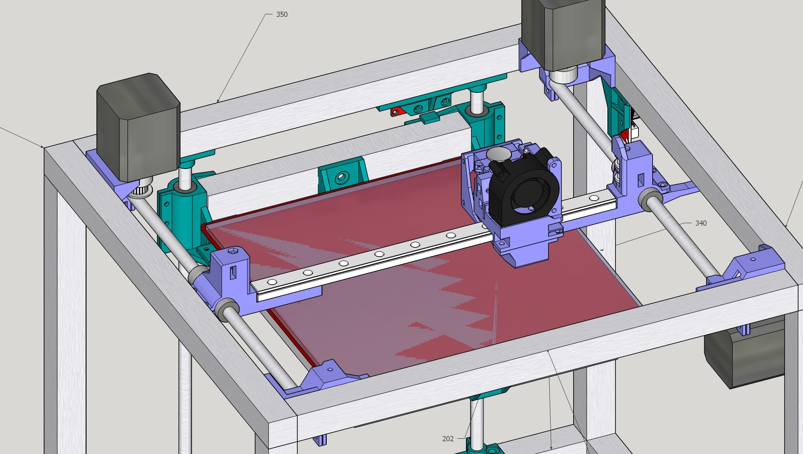

# FuseBox2/FuseBox2R
A new CoreXY 3D printer design. This design has 2 variants:

* FuseBox2R: An improved version using an MGN12 linear rail gantry.

* Fusebox2: The original design using a dual 8mm rod gantry.

## Specifications
* Rigid 2020(top and sides)/2040(bottom) aluminum extrusion frame
* Non-crossing CoreXY belt path
* 210x200x210mm build area
* 390x340x412mm size
* PCB heatbed with 3 point leveling
* Powerful 2040 part cooling blower
* E3D V6 or Lite6 + Bowden extruder
* 24v + 32 bit electronics recommended

## Additional features (FuseBox 2R upgrade)
* Lightweight and quiet MGN12 rail gantry
* 5-10mm more Y travel
* Modular fan duct

## Improvements over original FuseBox
* Slightly more compact
* Slightly larger build area
* Much greater frame and z axis rigidity
* Belt tensioning improvements - much easier to tension and screw-clamped to prevent slipping out
* Clamped bearing and rod mounts - no more structural zip ties
* Proper belt idlers - eliminates belt rubbing
* Extrusions (optionally) joined via tapped ends + screws instead of corner brackets
* Lowered part count
* Vertical gantry for easier hotend installation/removal and better cooling
* Better endstop mounting

# FuseBox2 v1.0.1

* Minor change from 1.0 - added adjustment screw for more precise Z offset adjustment. Eliminates 2 M5x8mm screws and t-nuts, and needs 1 additional M3x25mm (or longer) bolt and 2 additional M3 lock nuts.

# FuseBox2R v1.1

Switches out the twin 8mm rods on the gantry for a single MGN12 rail. Improvements include 30% gantry weight savings for less ringing and higher speeds, lowered bearing noise, easier belt tensioning, and a modular fan duct. Relatively inexpensive ($10-$15) MGN12 rails can be found on Aliexpress, so it's recommended to build this configuration if starting from scratch. The printed parts for the 2R gantry are in the r-gantry subfolder in the stl folder. If building from scratch, you can move these files into the stl directory to replace the old rod gantry parts with the new rail gantry parts.

## Changes in v1.1

Revised XY movement to simplify assembly and address issues with v1.0 gantry:

- X-end rigidity improvements
- Belts moved closer to centerline of MGN rail - alleviates x-end bending from belt tension; should further reduce ringing
- Corner idler brackets made more robust and compact - allows for a few mm more Y travel
- Homing direction reverted to x-min
- Thicker, more rigid 8mm rod holders with looser unclamped fit for easier rod installation

## Changes from FuseBox2
The entire CoreXY movement will need to be changed out. This includes all the parts on the gantry itself as well as the motor mounts and idler blocks.

Compared to the dual rod gantry, the belts may need to be shortened slightly.

# BOM

| Item | Quantity  |
|-----------------------------------------------------------------------------------------|----------|
| **Extrusions**  |
| 2020 extrusion, 350mm | 2  |
| 2020 extrusion, 340mm | 6  |
| 2020 extrusion, 184mm | 1  |
| 2020 extrusion, 202mm | 2  |
| 2040 extrusion, 184mm | 1  |
| 2040 extrusion, 350mm | 2  |
| 2040 extrusion, 300mm | 2  |
| **Heaters, motors, electronics**  |
| MK2 compatible PCB heatbed | 1  |
| Thermistor for heatbed | 1  |
| 15A 24v PSU or 30A 12v PSU | 1  |
| E3DV6 compatible hotend with PTFE tube and coupler | 1  |
| Any electronics (32 bit preferred, mounts available for azsmz board+lcd) | 1  |
| NEMA 17 stepper (60+ oz in/42+ N cm preferred) | 3  |
| NEMA 17 short body stepper (up to 30mm motor body length) | 1  |
| IEC socket with fuse and switch | 1  |
| ~5A 250v fuse | 1  |
| IEC power cord | 1  |
| Mechanical endstop (Note: cut off the microswitch from one endstop to use on the x axis) | 3  |
| 40mm axial fan | 1  |
| 2040 radial blower | 1  |
| **Mechanical**  |
| 8mm OD smooth rod, 300mm length | 6  |
| LM8LUU linear bearing | 6  |
| T8 leadscrew+nut, 250mm length, 2mm pitch preferred | 1  |
| 16T GT2 idler for 6mm belt - 6 toothed/2 smooth (recommended) or all smooth | 8  |
| 20T GT2 pulley for 6mm belt | 2  |
| 3m GT2 belt, 6mm | 1  |
| 625zz bearing | 1  |
| 5mm to 8mm flex coupler | 1  |
| MK8 extruder gear | 1  |
| **Fasteners and other hardware**  |
| M5x8mm button head bolt | 49  |
| M5x12mm button head bolt | 28  |
| M5 T nuts (drop-in recommended) | 49  |
| M3x8mm socket head bolt | 16  |
| M3x10mm button head bolt | 36  |
| M3x25mm button head bolt | 14  |
| Bed leveling spring, nut, and bolt set | 3  |
| Extruder spring | 1  |
| M3 lock nut | 50  |
| Adhesive felt feet | 4  |
| **Misc**  |
| ~200x213mm glass sheet | 1  |
| ~200x213mm PEI sheet with adhesive | 1  |
| Zip ties | Varies  |
| Cable mesh (optional) | Varies  |
| 18AWG wire for AC input | Varies  |
| 14AWG wire for heatbed and main DC power | Varies  |
| Small binder/bulldog clips for bed | 4  |

# FuseBox2R MGN12 upgrade BOM

| Item                            | Quantity |
|---------------------------------|----------|
| 250mm MGN12 Rail + MGN12C Block |  1       |
| M3x10mm bolt (button head)      |  2       |
| M3x6mm bolt (socket head)       |  4       |
| M3x10mm bolt (socket head)      |  4       |
| M3 lock nut                     |  1       |
| M3x25mm bolt (button head)      | -6       |
| M3x18mm bolt (button head)      |  4       |
| 300mm 8mm smooth rod            | -2       |
| LM8LUU bearing                  | -2       |

Note that the upgrade requires new fasteners and parts, but also gets rid of some. If upgrading, get only the positive quantity items. If building from scratch, add item amounts to base BOM.
